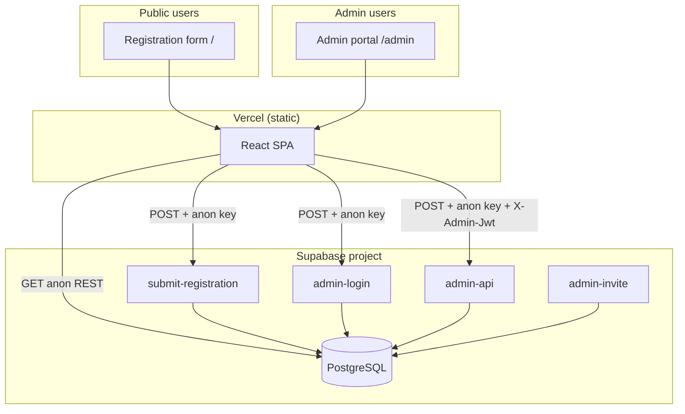

# Service Unit Registration Platform — Technical Handover

**Document version:** 1.0  
**Prepared for:** Incoming technology team and institution stakeholders  
**Repository:** [github.com/Iyamokuma/Service_U](https://github.com/Iyamokuma/Service_U)  
**Application:** Public registration form (`/`) + Admin portal (`/admin`)

---

## 1. Executive summary

This platform lets church members apply to join a **service unit** (and sub-unit) at a specific **branch / satellite church**. Applications flow into a **role-based admin dashboard** where leaders review, accept, or reject registrations. The system supports a multi-level hierarchy: global admins → country → state → satellite pastor → service unit leader → sub-unit leader.

**Stack (as built):**

| Layer | Technology |
|--------|------------|
| Frontend | React 19, Vite 6, React Router 7 |
| Hosting | Vercel (SPA, `dist/`) |
| Backend API | Supabase Edge Functions (Deno / TypeScript) |
| Database | Supabase PostgreSQL |
| Auth (admin) | Custom JWT (`ADMIN_JWT_SECRET`), not Supabase Auth |
| Public form submit | Edge Function `submit-registration` |
| Optional email | Resend (admin invite links only) |

All sensitive writes go through Edge Functions using the **service role key**. The browser never receives that key.

---

## 2. System architecture



**Read paths from the browser:**

- **Service units / sub-units / churches** — Supabase REST with anon key (RLS allows `SELECT` on active catalog rows only).
- **Admin operations** — Single RPC-style endpoint: `POST /functions/v1/admin-api` with body `{ op, params }`.

---

## 3. What the incoming team must create

### 3.1 Accounts and services

| # | Service | Purpose | Who owns it |
|---|---------|---------|-------------|
| 1 | **GitHub** (or GitLab) | Source control, CI hook to Vercel | Tech team |
| 2 | **Vercel** | Production + preview hosting | Tech team |
| 3 | **Supabase** | Postgres + Edge Functions | Tech team |
| 4 | **Custom domain** (optional) | e.g. `register.yourchurch.org` | Institution IT |
| 5 | **Resend** (optional) | Email invite links for new admins | Tech team |
| 6 | **DNS** | Point domain to Vercel; SPF/DKIM if using Resend | Institution IT |

No separate application server, Redis, or message queue is required for the current design.

### 3.2 Supabase project

1. Create a **new Supabase project** in the institution’s org (do not rely on the previous vendor’s project unless formally transferred).
2. Note:
   - Project URL → `VITE_SUPABASE_URL`
   - **anon public** key → `VITE_SUPABASE_ANON_KEY`
   - **service_role** key → Supabase secrets only (never in Vite env)
3. Enable **Edge Functions**.
4. Set function secrets (see §6).

### 3.3 Vercel project

1. Import the Git repository.
2. Framework preset: **Vite**.
3. Build: `npm run build` → output `dist/`.
4. Set environment variables for **Production** and **Preview** (see §6).
5. Configure custom domain if required (`vercel.json` already SPA-rewrites all routes to `index.html`).

### 3.4 Institution-owned data (not auto-generated)

The tech team must work with church leadership to supply or validate:

| Data | Where it lives | Notes |
|------|----------------|-------|
| Countries & states/regions | `directory_*`, `churches` | Migration seeds Nigeria-heavy sample data; replace/extend for your org |
| Satellite churches / branches | `churches`, `satellite_church_sites` | Applicant picks church on form; drives routing to admins |
| Service units & sub-units | `service_units`, `sub_units` | Global catalog (same unit names org-wide); IDs matter for leaders |
| Admin roster | `admins` | One Super Admin to start; hierarchy built from there |
| SMS / email templates (future) | `app_settings.templates` | JSON templates for status messages; broadcast SMS/email for announcements is scaffolded |

---

## 4. Database — tables to create

Apply migrations in **`supabase/migrations/`** in filename order (timestamp prefix). Do not hand-create tables unless you are forking the schema.

### 4.1 Core application

| Table | Purpose |
|-------|---------|
| `registrations` | Public form submissions; status pipeline (`new`, `in_progress`, `accepted`, `rejected`, `archived`) |
| `service_units` | Master list of service units (Choir, Ushering, etc.) |
| `sub_units` | Sub-units per service unit |
| `admins` | All admin users; custom password auth |
| `activity_logs` | Audit trail of admin actions |
| `admin_requests` | Approval workflow for new admin accounts |
| `app_settings` | Singleton row (`id = 1`): overdue days, permissions, message templates |

### 4.2 Location / church directory

| Table | Purpose |
|-------|---------|
| `directory_countries` | Legacy directory mirror |
| `directory_states` | States under countries |
| `directory_branches` | Branch names under states |
| `churches` | **Primary branch list for the public form** (`branch_country`, `branch_state`, `name`, `is_active`) |
| `satellite_church_sites` | Extended satellite metadata |
| Location request tables | From `202605140001_location_catalog_requests.sql` (data-entry proposals) |

### 4.3 Announcements & notifications

| Table | Purpose |
|-------|---------|
| `announcements` | Scoped broadcasts (members / leaders / admins by role) |
| `admin_notifications` | In-app alerts (e.g. overdue applications) |
| `overdue_notify_dedup` | Prevents duplicate overdue alerts per leader |

### 4.4 Operations

| Table | Purpose |
|-------|---------|
| `overdue_escalation` | Tracks escalation timestamps per registration |

### 4.5 Important columns added after initial create

- `registrations.satellite_site` — church routing (required for scoped queues)
- `registrations` identity uniqueness — phone/email (`202605250001_registration_identity_unique.sql`)
- Leader accept verification fields — `leader_accept_*` on registrations
- `admins.satellite_site`, invite columns (`must_change_password`, `invite_token`, `invite_expires_at`)
- `admins` HQ state for country admin (`202605280001_country_admin_headquarters_state.sql`)
- Announcement workflow columns — `202605240001_announcements_broadcast.sql`

### 4.6 Row Level Security (RLS)

- **Public (anon):** read-only on active `service_units`, `sub_units`, `churches`, directory tables.
- **Registrations, admins, settings, logs:** no anon access; Edge Functions use **service role** and bypass RLS.

### 4.7 What is *not* in Postgres today

- **Applicant photos** are stored as **base64/data URLs in `registrations.photo_path`**, not Supabase Storage. For large scale, plan a migration to Storage + CDN.
- **Admin passwords** are stored **in plaintext** in `admins.password` (documented in migrations as bootstrap-friendly). **Production handover must include a password-hashing migration** or enforced rotation policy.

---

## 5. Database setup procedure

### Option A — Supabase CLI (recommended)

```bash
# Install Supabase CLI, link to new project
supabase login
supabase link --project-ref YOUR_PROJECT_REF

# Apply all migrations
supabase db push

# Deploy edge functions
supabase functions deploy admin-api
supabase functions deploy admin-login
supabase functions deploy submit-registration
supabase functions deploy admin-invite

# Set secrets (see §6)
supabase secrets set ADMIN_JWT_SECRET="$(openssl rand -base64 32)"
supabase secrets set ADMIN_APP_URL="https://YOUR_DOMAIN/admin"
```

### Option B — SQL Editor

Run each file in `supabase/migrations/` sequentially in the Supabase SQL editor. Then deploy functions via CLI or dashboard.

### Post-migration validation

```sql
-- Expect rows
select count(*) from service_units;
select count(*) from churches where is_active = 1;
select count(*) from app_settings where id = 1;

-- Remove or rotate demo admins before go-live
select id, username, role, email from admins where is_active = 1;
```

**Seed warning:** `202605090002_admin_core_tables.sql` inserts demo admins with known passwords (`Admin@1234`, etc.). **Deactivate or delete these** and create institution-owned Super Admin credentials before launch.

Optional bulk church data: `supabase/seeds/salvation_ministries_structure.sql` (if used, coordinate with migrations to avoid duplicates).

---

## 6. Environment variables and secrets

### 6.1 Vercel (frontend — `VITE_*` exposed to browser)

| Variable | Required | Description |
|----------|----------|-------------|
| `VITE_SUPABASE_URL` | Yes | `https://xxxx.supabase.co` |
| `VITE_SUPABASE_ANON_KEY` | Yes | Supabase anon public key |
| `VITE_SUPABASE_FORM_SUBMIT_FN` | No | Default: `submit-registration` |

Copy from `.env.example` in the repo root.

### 6.2 Supabase Edge Function secrets

| Secret | Required | Description |
|--------|----------|-------------|
| `SUPABASE_URL` | Auto | Provided by Supabase |
| `SUPABASE_SERVICE_ROLE_KEY` | Auto | Provided by Supabase |
| `ADMIN_JWT_SECRET` | **Yes** | Random string; signs admin session JWT |
| `ADMIN_APP_URL` | **Yes** | Full URL to admin login, e.g. `https://yourdomain.com/admin` |
| `ADMIN_EMAIL_INVITES` | No | Set `true` to enable invite emails |
| `RESEND_API_KEY` | If invites | Resend API key |
| `RESEND_FROM_EMAIL` | If invites | Verified sender, e.g. `Admin <noreply@yourdomain.org>` |

---

## 7. Edge Functions reference

| Function | Auth | Role |
|----------|------|------|
| `submit-registration` | Anon key | Validates and inserts `registrations`; requires `church_id` |
| `admin-login` | Anon key | Username/email + password → JWT + admin profile |
| `admin-api` | `X-Admin-Jwt` header | All admin operations (`op` dispatch) |
| `admin-invite` | Token in URL | First-time password set for invited admins |

### `admin-api` operations (partial list)

`queue`, `stats`, `updateStatus`, `deleteReg`, `units`, `createUnit`, `updateUnit`, `deleteUnit`, `createSub`, `updateSub`, `deleteSub`, `admins`, `createAdmin`, `updateAdmin`, `deleteAdmin`, `members`, `requests`, `createRequest`, `updateRequest`, `settings`, `updateSettings`, `activity`, `announcements`, `createAnnouncement`, `updateAnnouncement`, `deleteAnnouncement`, `catalogList`, `catalogAddCountry`, `catalogAddState`, `catalogAddChurch`, `notifications`, `overdueAlerts`, …

Full list: `supabase/functions/_shared/admin_ops.ts` → `dispatchAdminOp`.

---

## 8. Application routes

| URL | Audience |
|-----|----------|
| `/` | Public registration form |
| `/admin` | Admin login |
| `/admin/*` | Authenticated admin SPA (queue, users, announcements, etc.) |

---

## 9. Admin roles (institution must understand)

Eight roles; permissions are enforced in `registration_scope.ts` (API) and `roles.js` (UI).

| Role key | Display name | Scope |
|----------|--------------|-------|
| `super_admin` | Super Admin | Global |
| `general_admin` | General Admin | Global (no destructive settings) |
| `data_entry_admin` | Data Entry Admin | Propose church locations |
| `country_super_admin` | Country Admin | One country |
| `state_super_admin` | State Branch Admin | One state/region |
| `satellite_church_admin` | Satellite Pastor Admin | One satellite church |
| `service_unit_leader` | Service Unit Leader | One service unit at one church |
| `sub_unit_leader` | Sub-Unit Leader | One sub-unit |

**Detailed role guide:** `docs/ADMIN_ROLES.md`  
**UI walkthrough:** `docs/ADMIN_DASHBOARD_GUIDE.md` (PDF: `docs/ADMIN_DASHBOARD_GUIDE.pdf`)

**Routing rule:** Registrations appear only for admins whose **country + state + satellite church + unit** match what the applicant selected on the form.

---

## 10. Local development

```bash
git clone https://github.com/Iyamokuma/Service_U.git
cd Service_U
npm install
cp .env.example .env.local   # fill VITE_* vars
npm run dev                  # http://localhost:5173
```

Admin features require a linked Supabase project with migrations applied and functions deployed. There is no mock backend in the repo.

---

## 11. Deployment checklist (go-live)

### Infrastructure

- [ ] New Supabase project created under institution account
- [ ] All migrations applied successfully
- [ ] All four Edge Functions deployed
- [ ] `ADMIN_JWT_SECRET` set (unique per environment)
- [ ] `ADMIN_APP_URL` matches production admin URL
- [ ] Vercel project connected to repo; `VITE_*` vars set
- [ ] Custom domain + HTTPS configured
- [ ] Demo seed admins removed or passwords rotated

### Data

- [ ] `churches` table reflects real branches (inactive churches hidden with `is_active = 0`)
- [ ] `service_units` / `sub_units` match ministry structure
- [ ] At least one **Super Admin** (and optionally **General Admin**) created
- [ ] Country / state / satellite / leader accounts created per org chart
- [ ] `app_settings.overdue_threshold_days` configured (default 3 days)

### Security

- [ ] Service role key never committed or exposed in frontend
- [ ] Plan for password hashing on `admins.password`
- [ ] Review RLS policies if enabling direct client access later
- [ ] CORS on Edge Functions is `*` today — tighten if needed for production domain only

### Verification

- [ ] Submit test registration from public form → appears in correct admin queue only
- [ ] Login as each role type → sidebar matches expected pages
- [ ] Status change `new` → `in_progress` → `accepted` works for unit leader
- [ ] Announcement create/send for one scoped role
- [ ] Activity log records admin login

---

## 12. Repository layout (for developers)

```
/
├── src/                    # React app (public form + admin)
│   ├── App.jsx             # Public registration form
│   ├── admin/              # Admin portal (/admin)
│   ├── sections/           # Form sections
│   └── lib/                # Supabase REST helpers
├── supabase/
│   ├── migrations/         # PostgreSQL schema (source of truth)
│   ├── functions/          # Edge Functions
│   └── seeds/              # Optional bulk data
├── docs/
│   ├── HANDOVER.md         # This document
│   ├── ADMIN_ROLES.md
│   └── ADMIN_DASHBOARD_GUIDE.md
├── .env.example
├── vercel.json
└── package.json
```

**Key backend files:**

- `supabase/functions/_shared/admin_ops.ts` — business logic
- `supabase/functions/_shared/registration_scope.ts` — who sees which registrations
- `src/admin/api.js` — frontend → `admin-api` client

---

## 13. Ongoing operations

| Task | How |
|------|-----|
| Add a church | Super/General Admin → Locations / catalog ops, or Data Entry request |
| Add service unit | Super/General Admin → Service Units |
| Create country admin | Super/General Admin → Admin Accounts |
| Change overdue SLA | Super Admin → Settings |
| Deploy code change | Push to `main` → Vercel auto-build; `supabase functions deploy` for API changes |
| Database change | Add new migration file; `supabase db push`; never edit old migrations in prod |

---

## 14. Known limitations and recommended follow-ups

1. **Plaintext admin passwords** — hash before institution-wide rollout.
2. **Photos in database text column** — move to object storage for performance.
3. **No Supabase Auth** — admin accounts are custom; SSO would be a separate project.
4. **Announcement SMS/email delivery** — schema and UI exist; confirm provider integration with incoming team.
5. **Single-tenant design** — one org per deployment; multi-tenant would need architectural review.

---

## 15. Handover deliverables from outgoing team

Provide the incoming team:

| Item | Notes |
|------|-------|
| GitHub repo access | Admin on org or transfer |
| Supabase project transfer **or** export + new project bootstrap | Include migration history |
| Vercel project transfer **or** reconnect to new Supabase |
| Domain registrar / DNS access | |
| Resend (or email) account | If invites enabled |
| List of production admin accounts | Without passwords in email — use secure channel |
| Institution org chart → admin role mapping | |
| Excel/source for church directory updates | |
| This document + `ADMIN_ROLES.md` + dashboard guide PDF |

---

## 16. Support contacts

Fill in before handover:

| Role | Name | Email |
|------|------|-------|
| Outgoing technical lead | | |
| Incoming technical lead | | |
| Institution product owner | | |
| Supabase org owner | | |
| Vercel team owner | | |

---

*End of handover document.*
